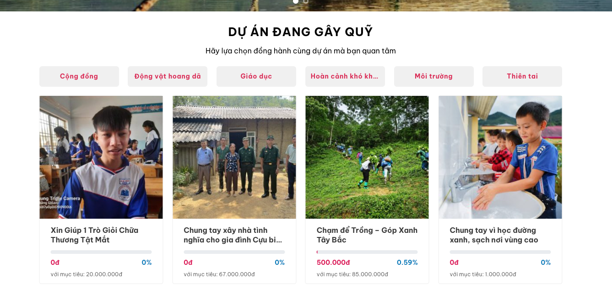

# Từ thiện WooCommerce Plugin

Plugin tạo hệ thống gây quỹ từ thiện (crowdfunding) tích hợp với WooCommerce, cho phép tạo và quản lý các chiến dịch từ thiện trực tuyến.



## Tính năng chính

### 🎯 Quản lý Chiến dịch Từ thiện
- Tạo và quản lý các chiến dịch gây quỹ từ thiện
- Thiết lập mục tiêu số tiền cần quyên góp
- Theo dõi tiến độ quyên góp realtime
- Upload hình ảnh và mô tả chiến dịch

### 💰 Hệ thống Ủng hộ
- Form ủng hộ với các mức tiền đề xuất
- Tùy chọn ủng hộ ẩn danh
- Xử lý thanh toán qua WooCommerce
- Hiển thị danh sách người ủng hộ

### 📊 Theo dõi và Báo cáo
- Thanh tiến độ (progress bar) trực quan
- Thống kê số tiền đã quyên góp và phần trăm hoàn thành
- Danh sách chi tiết các khoản ủng hộ
- Báo cáo tổng hợp chiến dịch

### 🎨 Tích hợp Frontend
- Hiển thị thông tin chiến dịch trên trang sản phẩm
- Progress bar và thống kê trong shop loop
- Shortcode hiển thị danh sách người ủng hộ
- Responsive design

## Yêu cầu hệ thống

- **WordPress:** 5.0 trở lên
- **PHP:** 7.2 trở lên  
- **WooCommerce:** 4.0 trở lên

## Cài đặt

1. **Tải plugin:**
   ```bash
   git clone [repository-url] crowdfunding-woocommerce
   ```

2. **Upload lên WordPress:**
   - Nén thư mục plugin thành file ZIP
   - Vào WordPress Admin → Plugins → Add New → Upload Plugin
   - Chọn file ZIP và nhấn "Install Now"

3. **Kích hoạt plugin:**
   - Vào Plugins → Installed Plugins
   - Tìm "Từ thiện WooCommerce" và nhấn "Activate"

## Cấu hình

### Thiết lập cơ bản

1. **Vào menu Từ thiện:**
   - Sau khi kích hoạt, menu "Từ thiện" sẽ xuất hiện trong admin
   - Menu WooCommerce gốc sẽ được ẩn để tập trung vào chức năng từ thiện

2. **Cấu hình cài đặt:**
   - Vào Từ thiện → Cài đặt
   - Thiết lập các tùy chọn cơ bản cho hệ thống

### Tạo chiến dịch mới

1. **Vào Từ thiện → Chiến dịch → Thêm mới**
2. **Điền thông tin:**
   - Tên chiến dịch
   - Mô tả chi tiết
   - Mục tiêu số tiền
   - Hình ảnh minh họa
3. **Xuất bản chiến dịch**

## Sử dụng

### Tạo trang ủng hộ

Tạo một trang mới với slug `/ung-ho-ngay` để làm trang ủng hộ chính:

```php
// Trang này sẽ tự động xử lý form ủng hộ và chuyển hướng thanh toán
```

### Hiển thị danh sách người ủng hộ

Sử dụng shortcode trong bài viết hoặc trang:

```
[danh_sach_ung_ho limit="10" show_anonymous="yes" show_date="yes" show_amount="yes"]
```

**Tham số shortcode:**
- `limit`: Số lượng người ủng hộ hiển thị (mặc định: 10)
- `show_anonymous`: Hiển thị người ủng hộ ẩn danh (yes/no, mặc định: yes)
- `show_date`: Hiển thị ngày ủng hộ (yes/no, mặc định: yes) 
- `show_amount`: Hiển thị số tiền ủng hộ (yes/no, mặc định: yes)
- `order`: Sắp xếp theo thời gian (ASC/DESC, mặc định: DESC)

## Cấu trúc File

```
crowdfunding-woocommerce/
├── crowdfunding-woocommerce.php    # File chính
├── assets/                         # Tài nguyên
│   ├── admin-script.js            # JavaScript admin
│   ├── admin-style.css            # CSS admin
│   └── frontend-style.css         # CSS frontend
├── includes/                       # Classes chính
│   ├── class-charity-campaigns.php    # Quản lý chiến dịch
│   ├── class-charity-donations.php    # Xử lý ủng hộ
│   ├── class-charity-frontend.php     # Hiển thị frontend
│   └── class-charity-settings.php     # Cài đặt plugin
└── README.md                       # Tài liệu này
```

## API và Hooks

### Functions Helper

```php
// Lấy thông tin chiến dịch
$campaign = charity_get_campaign($campaign_id);

// Lấy số tiền đã quyên góp
$raised = charity_get_campaign_raised($campaign_id);

// Lấy mục tiêu chiến dịch
$goal = charity_get_campaign_goal($campaign_id);
```

### Actions và Filters

```php
// Hook sau khi tạo chiến dịch thành công
add_action('charity_campaign_created', 'your_function');

// Filter để thay đổi text nút ủng hộ
add_filter('charity_donate_button_text', 'your_function');

// Hook sau khi ủng hộ thành công
add_action('charity_donation_completed', 'your_function', 10, 2);
```

## Tùy chỉnh

### CSS Classes chính

```css
.charity-campaign-info          /* Container thông tin chiến dịch */
.charity-progress-bar           /* Thanh tiến độ */
.charity-progress               /* Phần đã hoàn thành */
.charity-donate-button          /* Nút ủng hộ */
.charity-donors-list            /* Danh sách người ủng hộ */
.charity-campaign-info-loop     /* Thông tin trong shop loop */
```

### Tùy chỉnh template

Plugin sẽ tự động hiển thị thông tin chiến dịch, nhưng bạn có thể tùy chỉnh bằng cách:

1. **Override trong theme:**
   ```php
   // functions.php của theme
   function custom_charity_display() {
       // Code tùy chỉnh
   }
   ```

2. **Sử dụng CSS:**
   ```css
   /* Trong style.css của theme */
   .charity-progress-bar {
       height: 15px;
       background: #custom-color;
   }
   ```

## Troubleshooting

### Lỗi thường gặp

**1. Plugin không hoạt động:**
- Kiểm tra WooCommerce đã được cài và kích hoạt
- Đảm bảo phiên bản PHP >= 7.2

**2. Không thấy menu Từ thiện:**
- Kiểm tra quyền user (cần manage_options)
- Deactivate và activate lại plugin

**3. Progress bar không hiển thị:**
- Kiểm tra sản phẩm đã được đánh dấu là chiến dịch từ thiện
- Kiểm tra meta fields `_is_charity_campaign`, `_charity_goal`, `_charity_raised`

**4. Thanh toán không hoạt động:**
- Kiểm tra WooCommerce payment gateways
- Đảm bảo trang `/ung-ho-ngay` tồn tại

### Debug Mode

Bật debug bằng cách thêm vào `wp-config.php`:

```php
define('WP_DEBUG', true);
define('WP_DEBUG_LOG', true);
```

## Changelog

### Version 1.0.4 (Current)
- ✅ Ẩn menu WooCommerce trong admin
- ✅ Thêm hook hiển thị thông tin trong shop loop  
- ✅ Cải thiện UI/UX progress bar
- ✅ Tối ưu hóa shortcode danh sách ủng hộ

### Version 1.0.1
- 🎯 Phiên bản đầu tiên
- 📊 Chức năng cơ bản quản lý chiến dịch
- 💰 Hệ thống ủng hộ và thanh toán

## Hỗ trợ

- **Email:** [your-email@domain.com]
- **Documentation:** [Link tài liệu chi tiết]
- **Issues:** [Link GitHub Issues]

## License

GPL v2 or later

---

**Lưu ý:** Plugin này được phát triển để tích hợp với WooCommerce. Đảm bảo backup website trước khi cài đặt trên môi trường production.
